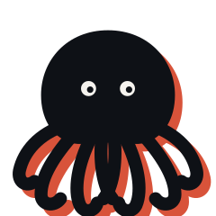

# Mimic



### Cognitive infrastructure for AI agents — built in Kuala Lumpur, Malaysia.

Inspired by the mimic octopus — one of nature's most sophisticated shapeshifters, capable of restructuring its body to impersonate different species based on environmental demand. First documented in Southeast Asia in 1998.

## Why we built this

Most agent frameworks ask you to decide upfront how many agents you need and what each one does. That works for simple workflows. It breaks down when tasks vary wildly in complexity.

We wanted an agent that figures out its own shape. One that carries memory across every form it takes. One that gets cheaper and faster the more it runs, through prompt caching and pattern recognition.

Mimic is our attempt at that. It is not finished. It is not perfect. But it runs, it morphs, and it remembers.

## How it works

Input → Sense → Score → Morph → Execute → Merge → Wagon

Every task goes through the same flow:
**Sense** — raw input captured instantly into sensory memory with a timestamp.

**Score** — the Chromatophores scorer analyses complexity, domain, and parallelizability. No API call. Pure heuristic. Fast and cheap.

**Morph decision** — if complexity is above threshold and the task is parallelizable, Mimic fragments into parallel arms. Otherwise it stays whole as Prime.

**Execute** — Prime mode runs one agent. Fragment mode runs multiple arms simultaneously using Python ThreadPoolExecutor. Real parallel execution, not simulated.

**Merge** — fragment results are unified into one coherent response.

**Wagon** — three-layer active memory inspired by cognitive psychology. Sensory, working, and long-term. Every run is logged to disk as a structured JSON file. Full audit trail.

**Example**

User asks: _"Research the top 3 vector databases and recommend one for a Malaysian startup."_

    Sense    → raw input captured, timestamp logged
    Score    → complexity 7.2/10, parallelizable: true
    Morph    → FRAGMENT(3)
    Arm 1    → researches Pinecone
    Arm 2    → researches Weaviate
    Arm 3    → researches Qdrant
    Merge    → unified comparison + recommendation
    Wagon    → full run logged to wagon_logs/run_001.json

## Benchmark

These are real numbers from a live run on May 19, 2026.

**Simple task** — "What is machine learning? Explain in 2 sentences."

    Mode:     PRIME
    Tokens:   94
    Latency:  2,928ms
    Calls:    1

**Complex task** — "Research the top 3 AI agent frameworks, compare their strengths and weaknesses, and recommend one for a Malaysian healthcare startup."

    Mode:          FRAGMENT
    Fragments:     3 arms
    Tokens:        6,955
    Cache saved:   ~5,865 tokens
    Latency:       243,801ms
    Calls:         5 (split + 3 arms + merge)

Prompt caching means the system prompt is written once and reused across all fragment arms. On the complex run above, caching saved 5,865 tokens — approximately 60% of what a naive parallel implementation would cost.

## Use cases

Mimic is infrastructure. It works for any task where:

- The work can be broken into parallel streams
- A full audit trail matters
- Token efficiency is important at scale
- Memory across runs adds value

Early deployments we are exploring: healthcare transcription, document analysis, research synthesis, and workflow automation.

We will publish real results as they come.

## Quick start

**Requirements**

- Python 3.10 or above
- An Anthropic API key

**Install**

```bash
git clone https://github.com/civi-ai/mimic.git
cd mimic
pip install anthropic
```

**Set your API key**

```bash
export ANTHROPIC_API_KEY="your-key-here"
```

**Run the demo**

```bash
python run.py
```

Mimic will run two tasks — one simple, one complex. Watch the morph decision happen in the terminal. Wagon logs are saved to `wagon_logs/` after each run.

## Architecture

Mimic's memory system is grounded in cognitive psychology rather than pure engineering convention.

**Three-layer Wagon memory**

- **Sensory** — captures raw input instantly, unprocessed, with timestamp
- **Working** — active scratch pad for the current run, clears after consolidation
- **Long-term** — permanent storage, written to disk as JSON after every run

This maps directly to Squire's (2009) taxonomy of human memory and Galotti's (2004) framework for memory formation and retrieval.

**Scoring — System 1 and System 2**
The Chromatophores scorer uses keyword heuristics for fast decisions — cheap, no API call. For ambiguous cases, a deeper Claude-based scorer can be invoked. This mirrors Kahneman's (2011) dual-process theory: fast intuitive judgement for clear cases, slow deliberate reasoning for uncertain ones.

**Prompt caching**
The system prompt is cached on first use and reused across all fragment arms. This was a deliberate architectural decision to minimise token cost at scale.

## Why not CrewAI or LangGraph?

| Feature              | CrewAI        | LangGraph     | Mimic              |
| -------------------- | ------------- | ------------- | ------------------ |
| Agent count          | Fixed upfront | Fixed upfront | Decided at runtime |
| Memory               | Partial       | External      | Native three-layer |
| Prompt caching       | No            | No            | Yes                |
| Cognitive foundation | No            | No            | Galotti, Kahneman  |
| Audit trail          | Partial       | No            | Full Wagon log     |

Mimic is not competing with these frameworks. It is a cognitive layer that can sit alongside them. But if you want an agent that decides its own shape and carries native memory — this is the gap they leave.

## Roadmap

This is where we are and where we are going. No dates. No guarantees.

**Done**

- Morphic core — Prime and Fragment modes
- Three-layer Wagon memory
- Prompt caching for token efficiency
- Benchmark reporting per run
- Wagon logs saved to disk as JSON

**In progress**

- Cortex layer — real-time metacognition
  An internal monitor that watches the agent think and flags uncertain reasoning before output is produced
- Visual demo — browser-based octopus animation showing arms extending in real time

**Exploring**

- Mycelium — privacy-preserving collective intelligence
  Pattern sharing across Mimic deployments without sharing data
  Sovereign AI across borders
- Dual scorer — System 1 heuristic fast pass, System 2 Claude deep analysis for ambiguous tasks

**Not on the roadmap**

- We are not building a UI framework
- We are not building a model
- We are not competing with LangChain or CrewAI
  Mimic is a cognitive layer that sits alongside them

## How this was built

Mimic was designed by Pratheebhan Saravanan, founder of Civi, using Claude (Anthropic) as a thinking and research partner. The cognitive psychology foundation — Galotti, Gollwitzer, Kahneman — was researched and applied by the human. The code was built with Claude and Claude Code (Anthropic). Architecture, cognition design, and systems thinking were human-led. Claude accelerated implementation. Claude Code handled rapid prototyping and iteration. We think this is the honest and right way to build in 2026 — human vision, AI execution speed. The theoretical grounding is real. The cognitive science references are real. The benchmark numbers are real. The code runs.

## Built by

Mimic is an open source project by [Civi](https://www.civi.com.my), a company building full stack AI for Southeast Asian markets — from infrastructure and models to products and deployment.

Based in Bangsar South, Kuala Lumpur, Malaysia.

If you are building something with Mimic, have feedback, or just want to talk agent architecture — reach out:

- Email: sprathee@civi.com.my
- LinkedIn: Pratheebhan Saravanan
- GitHub Issues: open one, we read them all

## References

Galotti, K. M. (2004). _Cognitive psychology in and out of the laboratory_ (4th ed.). Thomson Wadsworth.

Gollwitzer, P. M. (1993). Goal achievement: The role of intentions. _European Review of Social Psychology_, 4, 141–185.

Kahneman, D. (2011). _Thinking, Fast and Slow_. Farrar, Straus and Giroux.

Squire, L. R. (2009). Memory and brain systems: 1969–2009. _Journal of Neuroscience_, 29(41), 12711–12716.

---

_Mimic is open source. License TBD._
